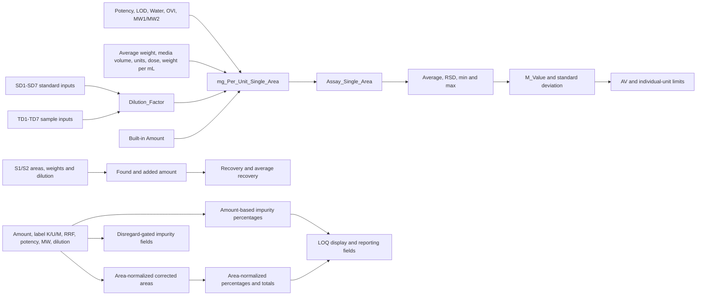

# Analysis: Custom_Field_F1.xlsx

## Evidence status and scope

- Source: `Custom_Field_F1.xlsx`, supplied by the user on 2026-09-14.
- The [exact source transcript](source-custom-field-f1.md) preserves every one of the 201 rows and all settings/formulas in `Sheet1!A1:L202`.
- The [field catalog](custom-field-f1-field-catalog.md) assigns every field to a calculation family and records direct dependencies.
- The [JSON inventory](custom-field-f1-inventory.json) is the machine-readable source for later agent/application work.
- Workbook rows are **user-provided workbook evidence**. Family names, acronym expansions, and purposes stated as likely or inferred are **assistant interpretations** until the user confirms them.
- The workbook contains field definitions rather than test inputs/results. It does not establish an Empower version, Search Order, All or Nothing, Sample Type, Peak Type, Missing Peak, translations, `Use As`, processing sequence, or observed outputs. No field is marked Empower-tested.

## Workbook structure

The workbook contains one worksheet and 201 definitions:

| Category | Count |
|---|---:|
| Sample fields | 35 |
| Peak fields | 131 |
| Component fields | 21 |
| Result fields | 14 |
| Keyboard-source fields | 56 |
| Calculated fields | 143 |
| External fields | 2 |
| Required manual inputs | 16 |
| Detected intersample/inter-injection fields | 36 |

The workbook stores Empower formulas as text, not as Excel formulas. It therefore documents field configuration but cannot independently calculate or verify any result.

## Overall architecture

The workbook follows a repeated design pattern:

1. **Component inputs** store analyte/standard values such as `SD1`-`SD7`, `Standard_Potency`, `MW1`, `MW2`, `Label_Claim`, `RRF1`, `RRF2`, LOD/Water/OVI standard corrections, and LOQ/disregard limits.
2. **Sample inputs** store preparation- or sample-specific values such as `TD1`-`TD7`, sample corrections, sample weight factors, media volume, number of units, and dose volume.
3. **Peak bridge fields** copy Component inputs into Peak scope, for example `MW1_1 = MW1` and `Water_Std_1 = Water_Std`. Two parallel SD naming sets exist: `SD1_1`-`SD7_1` and `SD_1`-`SD_7`.
4. **Peak calculations** combine built-in values (`Area`, `Amount`, `Value`, `SampleWeight`, retention time, widths) with the manual inputs.
5. **Intersample fields** retrieve or summarize standards, blanks, injections, or the same sample label.
6. **Result fields** aggregate Peak calculations with `SUM` or `MAX` for impurity totals and maximum unknown impurity.

No dependency cycles were detected among the 201 custom fields.

## Dependency overview



This diagram summarizes the workbook connections; exact formulas remain in the catalog and source transcript.

## Inputs and bridge fields

### Standard and sample dilution

- `SD1`-`SD7` are Component/Keyboard Real fields, precision 2, default 1, and not required in the workbook.
- `TD1`-`TD7` are Sample/Keyboard Real fields, precision 1, default 1, and required.
- `Dilution_Factor` is a Peak/Calculated Real field, precision 5.
- `STD_CON` retrieves the standard-dilution expression from an `S1`-labelled result.
- The two SD bridge families (`SD1_1`... and `SD_1`...) copy the same Component fields into Peak fields. Their distinct downstream purpose is not shown because no listed formula references either bridge family.

Workbook formula:

```text
1/SD1*SD2/SD3*SD4/SD5*SD6/SD7*TD1/1*TD3/TD2*TD5/TD4*TD7/TD6
```

This extends the user-confirmed 2026-09-12 expression by adding `*TD5/TD4*TD7/TD6`. Treat it as a newly supplied variant until the user confirms whether it supersedes the shorter formula.

The standard part is arithmetically equivalent to:

```text
(SD2*SD4*SD6)/(SD1*SD3*SD5*SD7)
```

The sample part is equivalent to:

```text
(TD1*TD3*TD5*TD7)/(TD2*TD4*TD6)
```

These are arithmetic explanations only. The workbook does not identify which entries are aliquots and which are final volumes.

### Correction and conversion inputs

- Standard/component inputs: `Standard_Potency`, `LOD_Std`, `Water_Std`, `OVI_Std`, `MW1`, `MW2`, `Label_Claim`, `RRF1`, and `RRF2`.
- Sample inputs: `LOD_Spl`, `Water_Spl`, `OVI_Spl`, `Average_Weight`, `Dissolution_Media_Volume`, `No_Of_Units`, `Dose_In_ml`, and `Weight_Per_mL`.
- Peak bridges expose several Component values under names ending in `1` or `_1`.

The workbook supports the earlier user convention that standard LOD/Water/OVI defaults are 0 and MW/Label Claim/RRF defaults are 1. It also supplies sample correction defaults of 0 and requires those three sample entries.

## Assay and content family

Primary chain:

```text
Amount + preparation/correction inputs
  -> mg_Per_Unit_Single_Area
  -> Assay_Single_Area
  -> Average_Percentage_Assay / RSD_Percentage_Assay / min / max
  -> Standard_Deviation_Perc_Assay and M_Value
  -> KS and AV
```

Exact principal formulas:

```text
mg_Per_Unit_Single_Area = Amount*Dilution_Factor*Standard_Potency/100*(100-LOD_Std-Water_Std-OVI_Std)/(100-LOD_Spl-Water_Spl-OVI_Spl)*Average_Weight*Dissolution_Media_Volume/No_Of_Units*Dose_In_ml*Weight_Per_mL*MW1/MW2

Assay_Single_Area = mg_Per_Unit_Single_Area/Label_Claim*100

Average_Percentage_Assay = SAME.%..AVE(Assay_Single_Area)

RSD_Percentage_Assay = SAME.%..%RSD(Assay_Single_Area)
```

`mg_Per_Unit_Average_Area` scales the single-area result by `Sample_Average_Area/Area`, and `Assay_Average_Area` converts it to percent label claim. `Assay_PPM` multiplies `Assay_Single_Area` by 10,000, while `Avg_Assay_PPM` averages that result across matching injections.

`Assay_Single_Area_Amnt_Label` uses `Amount_Label` as a different starting point. `Assay_Single_Area_Label_1st` and `_2nd` independently calculate and summarize injection 1 and injection 2, after which `AVG_Percentage_Assay_Label` averages the two fields. These are related alternate paths, not simple aliases.

The spreadsheet’s assay path contains more sample factors than the earlier conversation formula. Both remain preserved as separate evidence.

## Content uniformity and acceptance-value family

The names and equations strongly indicate a dosage-unit content-uniformity/acceptance-value calculation:

```text
Average_Percentage_Assay = SAME.%..AVE(Assay_Single_Area)
RSD_Percentage_Assay = SAME.%..%RSD(Assay_Single_Area)
Standard_Deviation_Perc_Assay = RSD_Percentage_Assay*Average_Percentage_Assay/100
KS = K*Standard_Deviation_Perc_Assay
AV = ABS(M_Value-Average_Percentage_Assay)+KS
```

`M_Value` appears intended to clamp the average to 98.5-101.5. `L2` defines individual-unit limits around M:

```text
Lower_Limit_Individual_Unit = (1-(0.01*L2))*M_Value
Higher_Limit_Individual_Unit = (1+(0.01*L2))*M_Value
```

`L1` defaults to 15 but is not used by another formula in this workbook. `K` defaults to 2.4. A second branch contains `K_30`, `KS_30`, and `AV_30`; however, `AV_30` adds `K_30` directly while `KS_30 = K_30*Standard_Deviation_Perc_Assay` is not referenced. This link needs confirmation.

## Accuracy and recovery family

Three related calculation paths appear:

1. `Added_Amount` derives an added standard amount from `Value`, SD inputs, potency, MW ratio, and 1000.
2. `Added_Amount_PPM` derives an added sample concentration from `SampleWeight`, TD inputs, sample potency, MW ratio, and 1000.
3. `Found_Amount`, `Found_Amoun_UNSP`, and `Found_Amount_PPM` derive found quantities from area response and standard references.

Outputs:

```text
Recovery = Found_Amount/Added_Amount*100
Recovery_UNSP = Found_Amoun_UNSP/Added_Amount*100
Percentage_Recovery = Found_Amount_PPM/Added_Amount_PPM*100
```

`AVE_RECOVERY_ASSAY` and `AVG_FOUND_AMOUNT` summarize matching injections. The suffix `UNSP` likely means unspiked, but that expansion is not present in the workbook. `Accuracy_Level`, `Sample_Concentration_PPM`, `Sample_Potency`, and `Test_Target_Conc_PPM` appear to describe method-validation levels/targets; `Test_Target_Conc_PPM` is not referenced by a listed formula.

`Found_Amount` subtracts an `AS`-labelled Area, while `Found_Amoun_UNSP` does not. The meaning of label `AS` must be confirmed.

## Blank and response correction

```text
Blank_Response = Blank.%.(Area)

Area_Correction = Area-(EQI(Peak Label,"M")*Blank_Response+EQI(Peak Label,"K")*Blank_Response+EQI(Peak Label,"U")*Blank_Response)

Response_Correction = (LTE(Area_Correction,0.0)*0.0)+(GT(Area_Correction,0.0)*Area_Correction)
```

For Peak Labels `M`, `K`, or `U`, `Area_Correction` subtracts the retrieved blank response. Other labels retain Area. `Response_Correction` then clamps a non-positive corrected response to zero. The likely label meanings are Main, Known impurity, and Unknown impurity; these expansions require user confirmation.

## Impurity calculation families

### Amount-based percentages

`Percentage_Impurity` gates the calculation to `K` or `U` peaks, then applies Amount, dilution, average weight, label claim, MW ratio, potency, and `RRF1/RRF2`. Separate fields calculate known and unknown impurity. Result fields sum them, and `Total_Impurities` adds the known and unknown Result totals.

The label variants use `SAME.1..MAX(...)` to place the injection-1 result across the same sample label. `Single_Max_Unknown_Impurity` returns the maximum unknown-impurity percentage in a result.

**2026-09-23 training:** For how Amount, Dilution_Factor, and Standard_Potency relate, and for comparing this amount-based known-impurity field to an external impurity-standard Area/Area × Conc/Conc equation (labels `S1`/`U1`, Peak Labels `K`/`U`/`M`, Path 1 vs Path 2 drafts), read [percentage-known-impurity.md](percentage-known-impurity.md) and [amount-empower.md](amount-empower.md). Do not treat the Path 1/Path 2 drafts as Empower-tested.

### AMV variant

`Percentage_Impurity_AMV` and `Percentage_Unknown_Imp_AMV` retrieve standard MW/potency information from label `S1` and use `STD_CON`. `AMV` likely refers to analytical method validation, but the workbook does not define it.

The AMV formulas use:

```text
TD1/1*TD3/TD2*TD5/TD4*TD6/TD7
```

The final ratio is `TD6/TD7`, the reverse of the `TD7/TD6` ratio in `Dilution_Factor`. Confirm whether this is intentional for the AMV preparation.

### Area-normalization variant (`AN`)

Likely `AN = Area Normalization`:

```text
Corrected_Area_AN
  -> Total_Corrected_Area_AN
  -> Percentage_Area_Corrected_AN
  -> known/unknown/all impurity percentages
```

`Corrected_Area_AN` divides K and U areas by `RRF2`, keeps M Area, and gives zero to other labels. `Percentage_Area_Corrected_AN` divides by the summed corrected area. The later impurity fields multiply again by `RRF1/RRF2`; this means `RRF2` participates once in corrected area and again in the final ratio for K/U peaks. That may be deliberate, but it requires confirmation.

The label version repeats the chain through `Corrected_Area_AN_Label`, `Total_Corrected_Area_AN_Label`, and `Percnt_Area_Corrected_AN_Labl`.

### Disregard threshold

```text
Disregard_Reference = CCompRef1[Standard_Average_Area]
Disregard_Value = Disregard_Factor*Disregard_Reference
Corrected_Area_Area_Dis = GTE(Area,Disregard_Value)*Area
```

Known/unknown impurity fields then multiply by `Corrected_Area_Area_Dis/Area`, which behaves like an inclusion flag when Area is nonzero. If Area is zero, this creates a potential `0/0` denominator case. The required `CCompRef1` assignment is absent from the workbook.

### LOQ filtering and reporting

`LOQ_Percentage` supplies a component threshold. Fields ending `_LOQ_Dis` multiply the percentage by `GTE(...,LOQ_Percentage)` so below-threshold values become zero. Fields ending `_LOQ_Report` instead emit special code `-60009` below the threshold. The Waters guide maps `-60009` to BPQL.

Result fields sum direct, AMV, or area-normalized values above the threshold.

`Total_Impurity_Label` adds `Total_Kown_IMP_Label` and `Total_Unknow_IMP_Label`. The known branch sums `Percentage_Known_IMP_AN_Label` using a case-only spelling difference from the defined `Percentage_Known_Imp_AN_Label`; the unknown branch sums the amount-based `Percentage_UNK_IMP_Label`. Confirm whether mixing the area-normalized known branch with the amount-based unknown branch is intended.

## Standard response and similarity family

- `Standard1_Area_SF`, `Standard1_Weight`, and `Standard1_Weight_SF` retrieve S1 Area/Value.
- `Standard2_Area_SF`, `Standard2_Weight`, and `Standard2_Weight_SF` retrieve S2 Area/Value.
- `Standard1_Average_Area` and `Standard2_Average_Area` average all injections for the matching label.
- `Similarity_factor` compares average areas after reciprocal weight correction.
- `Similarity_Factor_RS` performs the same ratio from single-reference fields.
- `Similarity_Factor_Online = Control Value/Amount` is a separate online comparison.
- `RESPONSE_RATIO = Similarity_factor*100` expresses the similarity factor as a percentage.
- `PERCENT_STANDARD_RSD` calculates `%RSD` for exact label `S1`; `CUMMULATIVE_PERCENT_RSD` uses label wildcard `S1%`.

`Standard_Average_Area = B*vt`, `Standard_Average_Area_Cal = B*vt`, and `Standard_Weight = vt`. The workbook does not define `B` or `vt`; do not infer their Empower meaning without the user’s configuration.

## Other calculation families

- **LOD/LOQ determination:** `LOD_DETERMIN_PPM = (3.3*Standard Error)/B` and `LOQ_DETERMIN_PPM = (10*Standard Error)/B`; percentage fields divide by `Sample_Concentration_PPM` and multiply by 100. Here LOD means Limit of Detection. `LOD_Std`/`LOD_Spl` are separate assay-correction percentages whose acronym expansion has not been supplied, so do not assume the two uses mean the same thing.
- **Dissolution:** `Percentage_Drug_Released` uses built-in `Dissolved Amount`, potency, dilution, MW ratio, and label claim, rounded to zero decimals. It does not divide Standard_Potency by 100, unlike many other fields; confirm the units/convention.
- **Residual solvent:** `Residual_Solvent = Amount*Dilution_Factor*Standard_Potency/100*1000000`.
- **Chromatography performance:** `Plate_Count_USP = 5.54*(Retention Time/Width @ 50%)**2`; `Relative_Resolution_HH` compares the current peak with `CCompRef1` using widths at 50% height. `HH` likely refers to half height but is unconfirmed.
- **Calibration/display helpers:** `Value_Amount_Table = .%.(Value)` retrieves Value across injections. `X_Axis_ppm` is formula-identical to `Added_Amount`, suggesting a calibration x-axis representation of the same concentration.
- **LIMS:** `PostedToLIMS` and `ReviewedInLIMS` are external Result/Text fields. No external mapping rules are present.

## Intersample and inter-injection fields

The 36 detected fields are grouped below. Exact formulas are in the field catalog.

| Group | Fields | Selectors and purpose inferred from formula |
|---|---|---|
| Assay injection outputs | `Assay_Single_Area_Label_1st`, `Assay_Single_Area_Label_2nd` | `SAME.1..MAX(...)` and `SAME.2..MAX(...)` select injection 1 or 2 for the same label. |
| Assay statistics | `Average_Percentage_Assay`, `Avg_Assay_PPM`, `MAX_ASSAY_SINGLE_AREA`, `MIN_ASSAY_SINGLE_AREA`, `RSD_Percentage_Assay`, `Sample_Response_Mean` | `SAME.%..` summaries across matching injections. |
| Injection display control | `AVE_RECOVERY_ASSAY`, `AVG_FOUND_AMOUNT`, `Sample_Average_Area` | Summaries plus `-50000` terms on injections 1 and 3; intended display behavior needs confirmation. |
| Blank/reference subtraction | `Blank_Response`, `Found_Amount` | `Blank.%.(Area)` and `AS.%.(Area)` retrieve labelled responses. |
| Standard-supplied recovery | `Found_Amount`, `Found_Amoun_UNSP`, `STD_CON` | Retrieve S1 potency, MW, and standard dilution inputs. |
| Impurity AMV | `Percentage_Impurity_AMV`, `Percentage_Unknown_Imp_AMV`, `Standard_Potency_AMV` | Retrieve values from label S1. |
| Impurity label projection | `Corrected_Area_AN_Label`, `Percentage_Impurity_Label`, `Percentage_Known_Imp_AN_Label`, `Percentage_Known_IMP_Label`, `Percentage_UNK_IMP_AN_Label`, `Percentage_UNK_IMP_Label` | `SAME.1..MAX(...)` projects injection-1 values across the same label. |
| Standard precision | `CUMMULATIVE_PERCENT_RSD`, `PERCENT_STANDARD_RSD` | `S1%` wildcard versus exact `S1` label. |
| Standard 1/2 similarity | `Standard1_Area_SF`, `Standard1_Average_Area`, `Standard1_Weight`, `Standard1_Weight_SF`, `Standard2_Area_SF`, `Standard2_Average_Area`, `Standard2_Weight`, `Standard2_Weight_SF`, `STD_AVG_Area` | Retrieve or summarize Area/Value for S1 and S2 labels and injections. |
| Current-label helper | `Value_Amount_Table` | `.%.(Value)` retrieves Value with omitted/current label and wildcard injection. |

These formulas cannot be recreated safely from this workbook alone because Search Order, All or Nothing, channel selection, result-set processing sequence, and summary-function rows are absent.

## Items requiring confirmation

1. Does the extended `Dilution_Factor` with TD4-TD7 replace the shorter formula previously confirmed? Which SD/TD fields are aliquots and final volumes?
2. Why do AMV impurity formulas end with `TD6/TD7` while `Dilution_Factor` ends with `TD7/TD6`?
3. What do the sample labels `S1`, `S2`, `S1%`, `AS`, and `Blank` mean, and which injections/channels are expected?
4. What Search Order, All or Nothing, Sample Type, Peak Type, Missing Peak, and summary-function settings belong to each intersample family?
5. What do `B`, `vt`, `Value`, `Control Value`, and `Dissolved Amount` represent and what are their units?
6. Please confirm the expansions of LOD in `LOD_Std`/`LOD_Spl`, OVI, AMV, UNSP, SF, RS, HH, AN, and the K/U/M Peak Labels.
7. Should `AV_30` add `KS_30` instead of `K_30`, or is the current link intentional?
8. Is the repeated `RRF2` use in the area-normalization chain intentional?
9. Is `Total_Impurity_Label` intentionally combining an area-normalized known branch with an amount-based unknown branch?
10. Does the case-only reference `Percentage_Known_IMP_AN_Label` resolve to `Percentage_Known_Imp_AN_Label` in the actual project, or is one spelling incorrect?
11. What is the intended effect of adding the `-50000` special-value term for injections 1 and 3?
12. Which fields are currently active at the site, and can one real result set be supplied for each main family to establish observed behavior?
